## Creating a new directory and entering the directory
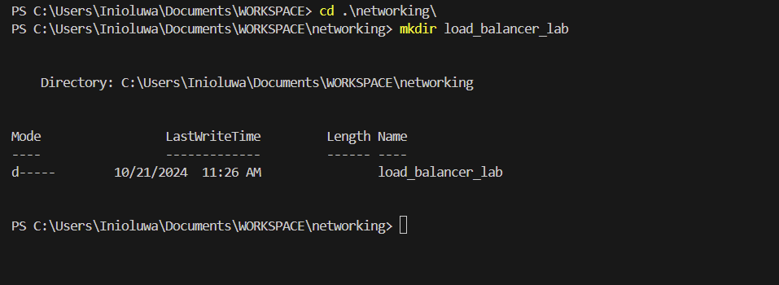

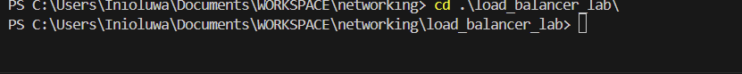

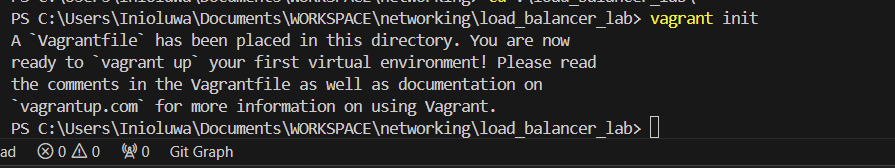

## Setting Up Vagrant Configuration

## Creating provisioning scripts

## Doing vagrant Up
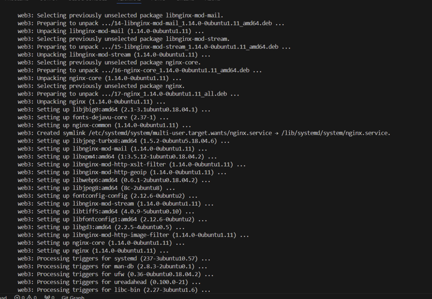

## Configuring nginx load balancer
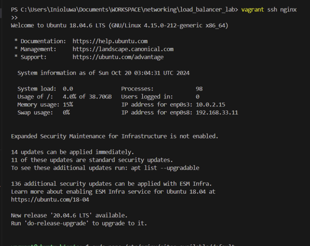

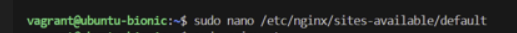

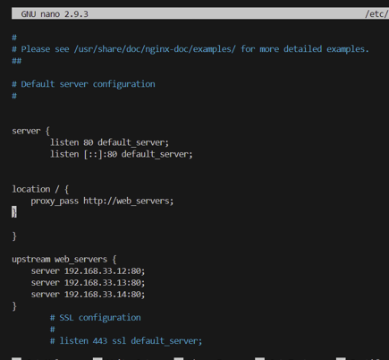

## Testing Load balancer

## Verifying load balancer

### web1 and its access logs
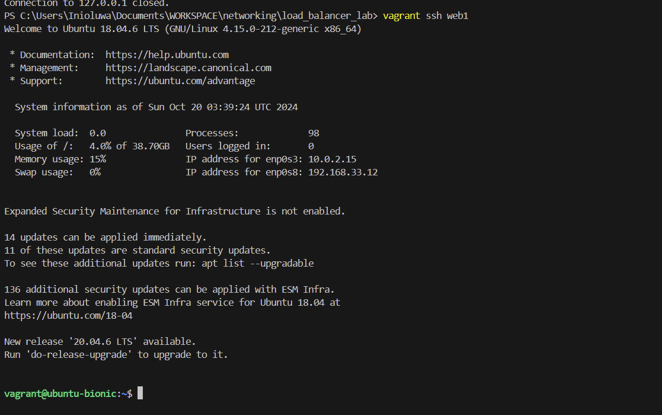

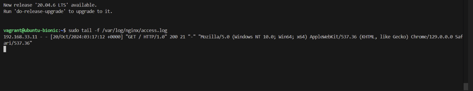

### web2 and its access logs
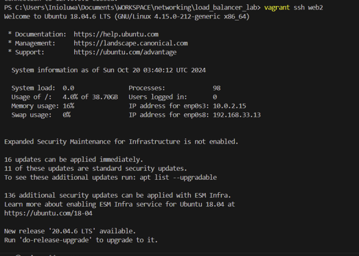

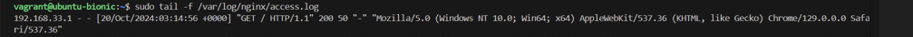

### web3 and its access logs
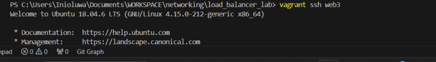

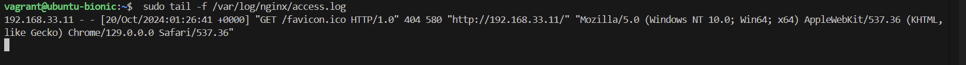

## Checking load balancer in web browser
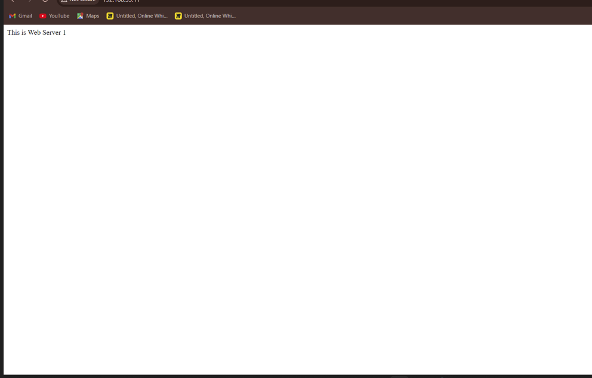