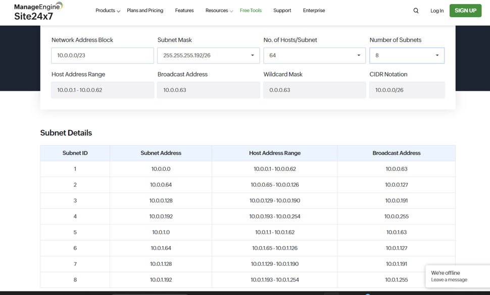
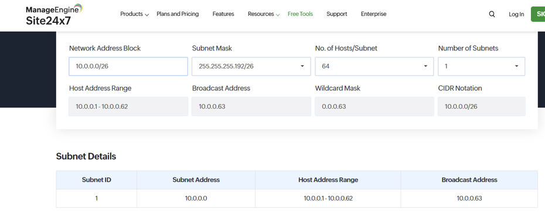
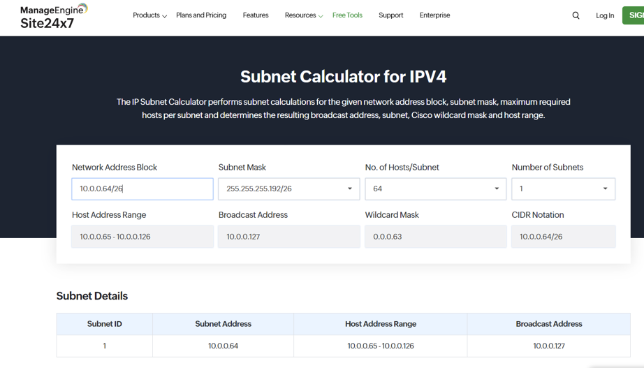
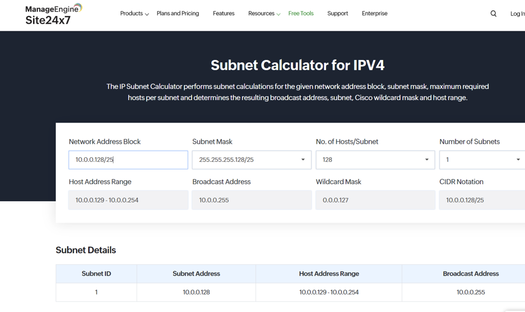
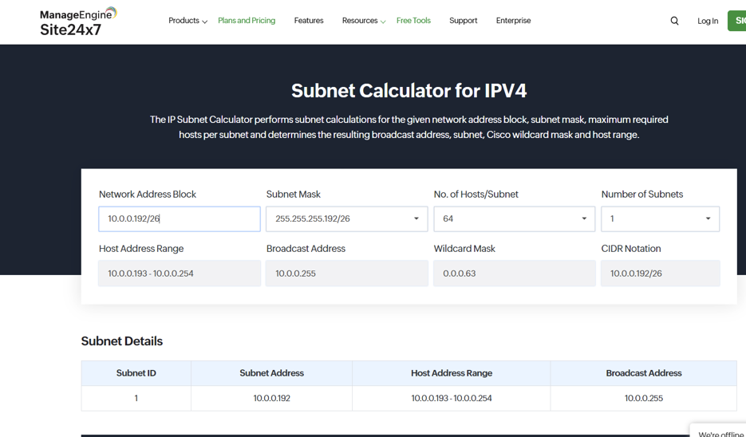
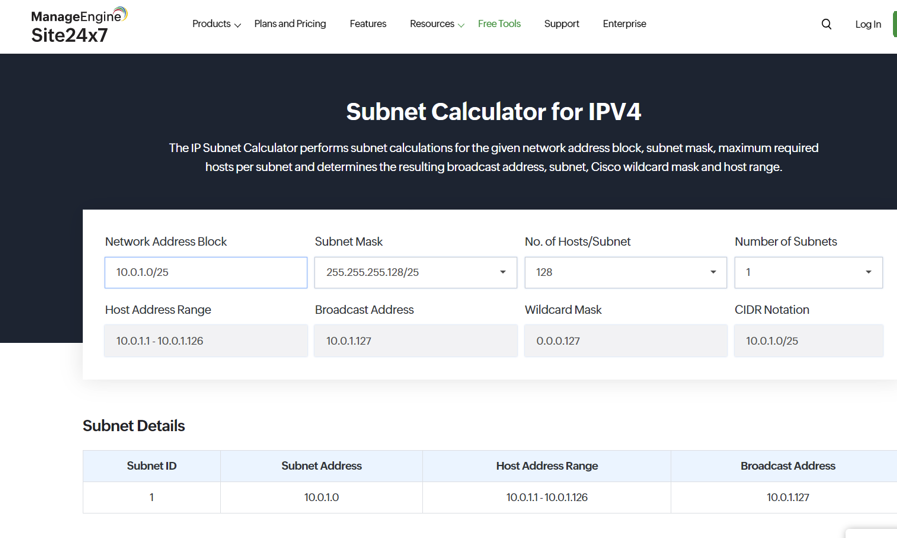
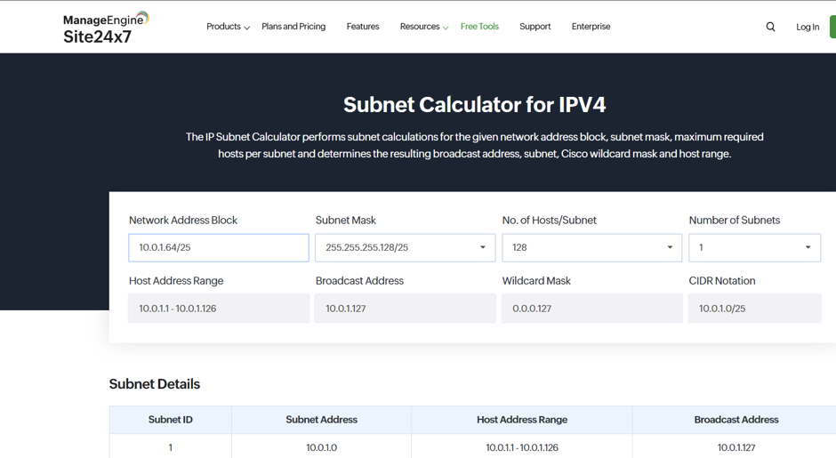

# I was asked to work with 6 Number of  subnets but because 6 subnets couldn't be found on the Number of subnets of sidal notation of /23. The /23 notation could only give me beyond 4 Number of subnets but couldn't give me 6 subnets, then, I went ahead with 8 Number of subnets

##  Identifying Subnet Requirements:

Departments:

Finance

Human Resources

Sales

Marketing

IT

Operations (with future growth of 50% in each department over the next 5 years)

## Allocating IP Addresses:
Subnets (including 50% future growth):

Finance: 75 hosts

Human Resources: 55 hosts

Sales: 95 hosts

Marketing: 65 hosts

IT: 125 hosts

Operations: 105 hosts

TOTAL=520

But including reserves, TOTAL=576

Total Subnets Required: 6

## Subnet Masking:
Subnet Masks (including 50% future growth):

Finance: /26 (255.255.255.192)

Human Resources: /26 (255.255.255.224)

Sales: /25 (255.255.255.128)

Marketing: /26 (255.255.255.192)

IT: /25 (255.255.255.128)

Operations: /25 (255.255.255.128)

##  Documentation:
IP Address Ranges:

Finance: 10.0.0.1 - 10.0.0.62	

Human Resources: 10.0.0.65 - 10.0.0.126	

Sales: 10.0.0.129 - 10.0.0.190	

Marketing: 10.0.0.193 - 10.0.0.254	

IT: 10.0.1.1 - 10.0.1.62	

Operations: 10.0.1.65 - 10.0.1.126	

## Purpose:
Finance: Financial transactions and accounting systems.

Human Resources: Employee data and payroll systems.

Sales: Customer relationship management (CRM) and sales data.

Marketing: Marketing campaigns and analytics.

IT: Network infrastructure and servers.

Operations: Production and supply chain management.

## Of 8 subnets wen 6 subnets could not be found on the Number of subnets

## finance

## Human resources

## Sales

## Marketing

## IT

## Operation

