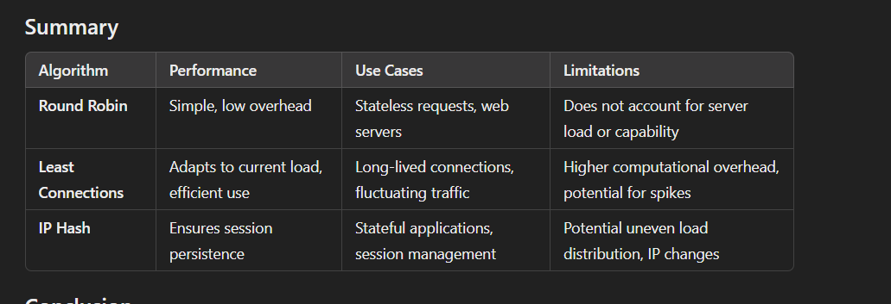
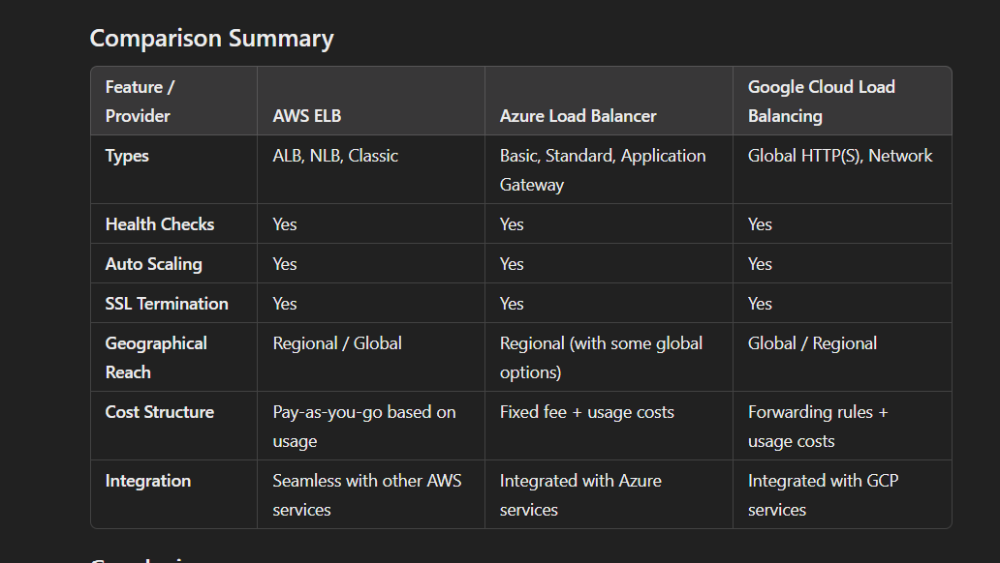
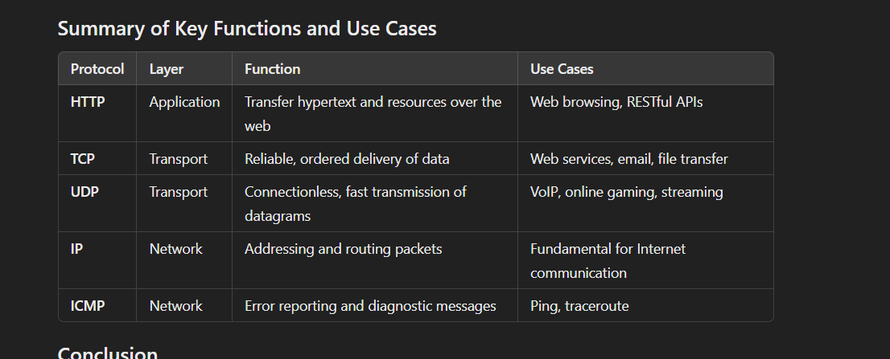

## Load Balancing Research Project Questions:

### Comparison of Load Balancing Algorithms:

#### Compare and contrast various load balancing algorithms such as Round Robin, Least Connections, and IP Hash. Evaluate their performance, use cases, and limitations.

Load balancing is a critical component of distributed systems, ensuring efficient resource utilization and optimal response times. Different load balancing algorithms cater to various scenarios, each with its strengths and weaknesses. Here’s a comparison of three popular algorithms: Round Robin, Least Connections, and IP Hash.

1. Round Robin

- Overview: Round Robin is a straightforward algorithm that distributes incoming requests sequentially across a pool of servers. Each server gets an equal share of requests in a cyclic manner.

Performance:

Simplicity: Easy to implement and understand.
Overhead: Minimal processing overhead as it merely maintains a pointer to the last server.
Use Cases:

Ideal for environments where requests are roughly equivalent in terms of resource requirements.
Commonly used in web servers or applications with stateless requests.

Limitations:

Unequal Load: Doesn’t account for server performance or current load. A server with higher processing power may finish tasks quicker but will still receive requests at the same rate as less capable servers.
Stateful Applications: Ineffective for applications that maintain session state unless sessions are managed externally.

2. Least Connections

- Overview: The Least Connections algorithm directs traffic to the server with the fewest active connections. This method aims to balance the load based on current server utilization.

Performance:

Dynamic Load Balancing: Adjusts to current server load, making it more efficient than Round Robin in scenarios with varied request durations.

Resource Utilization: Can lead to better resource utilization in environments with unequal processing times.
Use Cases:

Particularly useful for applications where connections vary significantly in duration, such as database connections or long-lived sessions.
Effective in environments with fluctuating traffic patterns.

Limitations:

Overhead: Requires more computation to track active connections, which can introduce latency.
Connection Spikes: Sudden surges in traffic might cause temporary imbalances if one server becomes overloaded while others remain underutilized.

3. IP Hash

Overview: IP Hash uses the client's IP address to determine which server will handle the request. A hash function processes the IP to generate a consistent mapping to a specific server.

Performance:

Session Persistence: Ensures that requests from the same client are consistently directed to the same server, which is beneficial for session-based applications.
Distributed Load: Can help evenly distribute traffic based on client location.

- Use Cases:

Suitable for applications requiring session persistence, such as e-commerce platforms where user sessions need to be maintained.

Effective in geographically distributed environments to minimize latency.

Limitations:

Uneven Distribution: If clients’ IP addresses are concentrated (e.g., in corporate networks), some servers may receive more requests than others.

Change in Client IP: Mobile clients or users behind proxies may end up with varying IPs, leading to inconsistency in session handling.

#### High Availability with Load Balancing:

#### Investigate how load balancers contribute to achieving high availability in a web application. Explore various redundancy and failover strategies used in load balancing.

Load balancers play a crucial role in achieving high availability for web applications by distributing traffic efficiently, ensuring that no single server becomes a bottleneck, and enhancing overall system resilience. Here’s how load balancers contribute to high availability, along with various redundancy and failover strategies.

- How Load Balancers Contribute to High Availability

Traffic Distribution: Load balancers evenly distribute incoming traffic across multiple servers (or instances). This prevents any one server from becoming overwhelmed and reduces the likelihood of downtime due to high traffic.

1. Health Monitoring: Load balancers continuously monitor the health of backend servers. If a server fails or becomes unresponsive, the load balancer can automatically reroute traffic to healthy servers, minimizing service interruption.

2. Session Persistence: By maintaining session persistence (also known as sticky sessions), load balancers can direct requests from a specific user to the same server throughout a session. This helps in scenarios where session data is stored locally.

3. SSL Termination: Load balancers can handle SSL termination, offloading the SSL decryption work from backend servers. This not only improves performance but also simplifies certificate management.

4. Geographical Distribution: Global load balancers can route traffic to the nearest data center or server based on the user's location, reducing latency and improving performance.

 Redundancy and Failover Strategies

1. Active-Passive Configuration:

Description: In this setup, one load balancer (the active one) handles all traffic while the other (the passive one) remains on standby. If the active load balancer fails, the passive one takes over.

Benefit: Simple and cost-effective; provides a backup in case of failure.

Limitation: The passive load balancer is not utilized until a failure occurs, which can be wasteful.

2. Active-Active Configuration:

Description: Multiple load balancers are configured to handle traffic simultaneously. If one load balancer fails, the others continue to serve traffic without interruption.

Benefit: Maximizes resource utilization and provides seamless failover.

Limitation: More complex to configure and manage; requires additional load balancing algorithms to distribute traffic among active instances.

3. Geographic Redundancy:

Description: Deploying load balancers across multiple geographic locations ensures that if one data center goes down, traffic can be redirected to another data center.

Benefit: Enhances resilience against regional outages and natural disasters.

Limitation: Increased complexity and potential latency in cross-region traffic routing.

4. DNS-Based Load Balancing:

Description: DNS records are used to direct traffic to different load balancers based on their availability and health status. Techniques like round-robin DNS can distribute traffic among multiple IP addresses.

Benefit: Simple implementation and can help with geographic redundancy.

Limitation: DNS caching can lead to stale records and slow propagation of changes in case of server failures.

5. Health Checks and Automatic Failover:

Description: Load balancers perform regular health checks on backend servers to determine their status. If a server is detected as unhealthy, the load balancer automatically stops routing traffic to it.

Benefit: Ensures that only healthy servers receive traffic, reducing downtime.

Limitation: If health checks are misconfigured, they could lead to unnecessary failover or keep unhealthy servers in rotation.

6. Session Replication:

Description: In stateful applications, session data is replicated across multiple servers. If one server fails, another can take over with the same session information.

Benefit: Minimizes disruption for users by maintaining session continuity.

Limitation: Additional overhead for data synchronization can affect performance.

### Scalability and Load Balancing:

#### Study the relationship between scalability and load balancing. Explain how load balancers help in the efficient scaling of web applications.

The relationship between scalability and load balancing is fundamental in designing and maintaining high-performance web applications. Scalability refers to the capability of a system to handle increased loads, whether by adding resources (vertical scaling) or by adding more nodes (horizontal scaling). Load balancers play a critical role in enabling and managing this scalability efficiently. Here’s how they contribute to the scaling of web applications:

1. Facilitating Horizontal Scaling

Definition: Horizontal scaling involves adding more servers to distribute the load. This can be more cost-effective and efficient compared to vertical scaling (adding resources to a single server).

Role of Load Balancers: Load balancers distribute incoming traffic across multiple servers in a horizontal scaling environment. By directing requests intelligently, they ensure that no single server is overwhelmed, enabling the application to handle a higher volume of traffic without performance degradation.

2. Dynamic Resource Allocation

Auto-Scaling: Many cloud environments provide auto-scaling features that automatically add or remove server instances based on current traffic levels and performance metrics. Load balancers integrate with these auto-scaling systems to manage traffic distribution dynamically.

Seamless Addition/Removal: When new servers are added to the pool, the load balancer can immediately start routing traffic to them. Similarly, when servers are removed (due to low demand), the load balancer stops sending traffic to those instances, maintaining optimal resource use.

3. Traffic Management

Routing Algorithms: Load balancers use various algorithms (e.g., Round Robin, Least Connections) to manage how traffic is distributed among servers. This allows applications to efficiently scale as they grow by ensuring that each server is utilized according to its capacity and current load.

Session Handling: Load balancers can manage session persistence, which is crucial for stateful applications. By ensuring users are directed to the correct server based on their session information, load balancers support scalable architectures without sacrificing user experience.

4. Isolation and Fault Tolerance

Failure Management: Load balancers monitor the health of servers and automatically redirect traffic away from any that are down or underperforming. This fault tolerance is crucial for maintaining service availability as the application scales.

Impact on Scaling: By isolating failures and ensuring that healthy servers continue to handle requests, load balancers enable applications to scale up or down without affecting overall service reliability.

5. Global Traffic Distribution

Geographic Load Balancing: For applications with a global user base, load balancers can direct traffic to different data centers or cloud regions based on user location. This not only reduces latency but also allows for better resource management across different geographic regions.

Scalable Global Presence: This geographic distribution supports scalability by enabling applications to efficiently serve users worldwide, balancing loads based on regional demand and server availability.

6. Performance Optimization

Caching and Compression: Some load balancers can cache content or compress data before it is sent to users. This reduces the load on backend servers and improves response times, which is especially important as traffic scales.

Enhanced User Experience: By optimizing performance through these features, load balancers help maintain a fast and responsive user experience even as the application scales to accommodate more users.

### Load Balancing in Cloud Environments:

#### Analyze load balancing solutions provided by major cloud service providers like AWS, Azure, and Google Cloud. Compare their features and cost-effectiveness.

Load balancing solutions are crucial for managing traffic and ensuring high availability in cloud environments. Major cloud service providers like AWS, Azure, and Google Cloud offer robust load balancing solutions with varying features and pricing models. Here’s a detailed analysis and comparison of their offerings.

1. Amazon Web Services (AWS)

Load Balancing Solutions

- Elastic Load Balancing (ELB):

Types:

Application Load Balancer (ALB): Best for HTTP/HTTPS traffic, supports advanced routing, WebSocket, and HTTP/2.

Network Load Balancer (NLB): Optimized for TCP traffic, capable of handling millions of requests per second while maintaining ultra-low latency.

Classic Load Balancer: Legacy option that supports both HTTP/HTTPS and TCP traffic, but with fewer features.

- Features

Health Checks: Regular health checks of targets.
Auto Scaling Integration: Works seamlessly with AWS Auto Scaling.

SSL Termination: Supports SSL certificate management.
Cross-Zone Load Balancing: Distributes traffic across multiple availability zones.

Cost-Effectiveness

Pricing Model: Charged based on the number of hours the load balancer runs and the amount of data processed (GB). ALB and NLB have different pricing structures, with NLB being slightly more expensive due to its performance characteristics.

2. Microsoft Azure

Load Balancing Solutions
Azure Load Balancer:

- Types:
Basic Load Balancer: Suitable for small applications with less redundancy.

Standard Load Balancer: Offers higher availability and supports multiple backends.

Application Gateway:
Features: Provides application-level routing and load balancing, SSL termination, and Web Application Firewall (WAF) capabilities.

- Features
Health Probes: Monitors the health of backend instances.
Customizable Rules: Supports URL-based routing and session persistence.

Integration with Azure Services: Works well with Azure Virtual Machines, Kubernetes, and App Services.
Global Load Balancing: Supports traffic distribution across global regions.

Cost-Effectiveness

Pricing Model: Charges based on the number of load-balanced instances and the data processed. Standard Load Balancer has a fixed fee and usage costs, while Application Gateway pricing is based on throughput units and WAF usage, making it potentially more costly.

3. Google Cloud Platform (GCP)

Load Balancing Solutions
Google Cloud Load Balancing:

 - Types:

Global HTTP(S) Load Balancer: Supports content-based routing for HTTP/HTTPS traffic and operates at the global level.

Network Load Balancer: Designed for TCP/UDP traffic, operates at regional levels.

- Features

Integrated CDN: Can easily integrate with Cloud CDN for faster content delivery.

Health Checks: Customizable health checks for backend services.

Auto-scaling: Works with Google Kubernetes Engine and Compute Engine for dynamic scaling.

SSL Offloading: Manages SSL termination for improved backend performance.

Cost-Effectiveness

Pricing Model: Charges based on the number of forwarding rules, data processed, and the load balancer type. The global HTTP(S) load balancer has a different pricing structure than regional load balancers, potentially offering cost savings for large-scale applications due to its ability to distribute traffic globally.

### Security Implications of Load Balancers:

#### Explore the security aspects of load balancers. Investigate how load balancers can be configured to enhance security, including protection against DDoS attacks.

Load balancers are not only essential for distributing traffic and ensuring high availability, but they also play a critical role in enhancing the security of web applications. By strategically configuring load balancers, organizations can protect their infrastructure against various threats, including Distributed Denial of Service (DDoS) attacks and other vulnerabilities. Here’s an exploration of how load balancers contribute to security and best practices for their configuration.

- Security Aspects of Load Balancers

1. Traffic Filtering and Rate Limiting

Traffic Inspection: Load balancers can inspect incoming traffic and filter out malicious requests based on predefined rules, helping to identify and block potentially harmful traffic.

Rate Limiting: Configuring rate limits on the number of requests from a single IP address can help mitigate the impact of DDoS attacks by preventing any single user from overwhelming the application.

2. SSL/TLS Termination

Secure Data Transmission: Load balancers can handle SSL/TLS termination, encrypting traffic between clients and the load balancer while ensuring secure communication to backend servers.

Certificate Management: This offloads the SSL processing from backend servers, allowing them to focus on application logic and reducing their exposure to vulnerabilities.

3. Web Application Firewall (WAF) Integration

Layered Security: Many load balancers can integrate with Web Application Firewalls (WAFs) to provide an additional layer of security against common web vulnerabilities (e.g., SQL injection, cross-site scripting).

Custom Rules: WAFs can be configured with custom rules to block known attack patterns, enhancing protection against both automated and targeted attacks.

4. DDoS Protection

Built-in DDoS Mitigation: Many cloud providers offer load balancers with built-in DDoS protection features that automatically detect and mitigate attacks. This can include absorbing and dispersing traffic across a network of servers to prevent any single point of failure.

Anomaly Detection: Advanced load balancers may use machine learning algorithms to detect anomalies in traffic patterns, triggering automated responses to mitigate potential DDoS attacks.

5. Geographic Filtering and IP Whitelisting

Geographic Restrictions: Load balancers can be configured to allow or block traffic based on geographic location, helping to reduce exposure to threats from specific regions known for malicious activity.

IP Whitelisting: Organizations can implement IP whitelisting to restrict access to only known, trusted IP addresses, enhancing security for sensitive applications.

6. Session Management and Security

Session Persistence: Load balancers can manage session persistence (sticky sessions) while ensuring that session data is handled securely, minimizing the risk of session hijacking.

Session Timeout Policies: Configurable session timeout settings can help protect against unauthorized access by automatically logging out inactive users.

Best Practices for Configuring Load Balancers for Security

1. Use HTTPS Everywhere

Always enforce HTTPS to encrypt data in transit, ensuring that sensitive information is protected from eavesdropping and man-in-the-middle attacks.

2. Regularly Update and Patch

Keep load balancer software and firmware up to date with the latest security patches to protect against known vulnerabilities.

3. Implement Strong Authentication

Use strong authentication methods (such as OAuth or API tokens) for accessing load balancer management interfaces and backend services.

4. Monitor and Log Traffic

Enable logging on load balancers to capture traffic patterns, which can be analyzed for unusual activity. Set up alerts for suspicious behavior that may indicate an attack.

5. Redundancy and Failover Configurations

Configure load balancers in an active-active or active-passive redundancy setup to ensure that security measures remain intact even if one instance fails.

6. Conduct Regular Security Audits

Perform routine security audits and penetration testing to identify vulnerabilities in the load balancing setup and address them proactively.

7. Leverage Cloud Provider Security Features

Use additional security features provided by cloud vendors, such as AWS Shield for DDoS protection, Azure DDoS Protection, or Google Cloud Armor.

### Container Orchestration and Load Balancing:

#### Investigate how container orchestration platforms like Kubernetes handle load balancing. Explain the integration of load balancers in containerized environments.

Container orchestration platforms like Kubernetes are designed to automate the deployment, scaling, and management of containerized applications. One of the critical components of these platforms is their ability to handle load balancing effectively. Here’s how Kubernetes manages load balancing and integrates load balancers within containerized environments.

Load Balancing in Kubernetes

Kubernetes provides several mechanisms for load balancing to ensure that traffic is distributed evenly among the containerized applications (Pods) running in the cluster. Here are the primary load balancing features and components in Kubernetes:

1. Service Abstraction

Kubernetes Services: A Service in Kubernetes is an abstraction that defines a logical set of Pods and a policy for accessing them. This abstraction enables load balancing by providing a stable endpoint (an IP address or DNS name) for accessing a group of Pods.

ClusterIP: The default Service type that exposes the Service on a cluster-internal IP. This allows communication between Pods without exposing them externally. Traffic is distributed among the Pods in the Service.

2. Load Balancer Service Type

LoadBalancer: When a Service is created with the type LoadBalancer, Kubernetes integrates with the cloud provider’s load balancer (e.g., AWS ELB, Google Cloud Load Balancer) to create an external load balancer. This load balancer forwards traffic to the Service’s endpoints, which are the Pods behind the Service.

Integration with Cloud Providers: This integration automatically provisions a load balancer that routes external traffic to the appropriate Pods, providing a seamless way to expose applications running in Kubernetes clusters to the outside world.

3. NodePort

NodePort Service: A NodePort exposes the Service on a static port on each Node in the cluster. Traffic sent to this port is forwarded to the underlying Pods. While this does not provide a true load balancer, it allows access to Pods via any Node's IP address.

Use Case: NodePort is often used for development and testing or in environments without external load balancing.

4. Ingress Controllers

Ingress Resource: Ingress is an API object that manages external access to Services, typically HTTP. It can provide load balancing, SSL termination, and name-based virtual hosting.

Ingress Controllers: To implement Ingress, an Ingress Controller (such as NGINX, Traefik, or cloud-native controllers) is required. The Ingress Controller listens for Ingress resources and manages the traffic routing accordingly.

Advanced Features: Ingress Controllers can implement features like URL-based routing, host-based routing, and centralized SSL certificate management, enhancing the flexibility of load balancing.

5. Internal Load Balancing

CoreDNS: Kubernetes uses CoreDNS for service discovery, allowing Pods to find each other through DNS resolution. This internal load balancing mechanism enables efficient routing of traffic between services running within the cluster.

Service Discovery: Services can communicate with each other through DNS names (e.g., my-service.my-namespace.svc.cluster.local), facilitating load balancing among service instances.

Integration of Load Balancers in Containerized Environments
Provisioning: When a Service of type LoadBalancer is created, Kubernetes interacts with the cloud provider’s API to provision a new load balancer. This process is managed through the Kubernetes controller manager.

Health Checks: Load balancers integrated with Kubernetes can perform health checks on the Pods behind the Service. If a Pod becomes unhealthy, the load balancer will stop routing traffic to it, ensuring only healthy Pods receive requests.

Scaling: As Pods are scaled up or down, Kubernetes automatically updates the endpoints for the Service, allowing the load balancer to distribute traffic accordingly without manual intervention.

Configuration Management: Ingress Controllers can be configured through annotations and custom resource definitions, allowing teams to manage routing rules dynamically as application requirements change.

Monitoring and Logging: Monitoring tools (like Prometheus, Grafana) and logging solutions can be integrated to provide insights into traffic patterns, performance metrics, and load balancer health, helping teams optimize the load balancing strategy.

### Load Balancing and Microservices:

#### Examine the role of load balancing in a microservices architecture. Discuss the challenges and best practices for load balancing in microservices.

Load balancing plays a crucial role in microservices architecture, ensuring efficient distribution of traffic among services and maintaining high availability and performance. Given the dynamic and distributed nature of microservices, effective load balancing becomes essential for scalability, fault tolerance, and overall system reliability. Here’s an examination of its role, challenges, and best practices.

Role of Load Balancing in Microservices Architecture

1. Traffic Distribution: Load balancers distribute incoming requests across multiple instances of microservices. This prevents any single instance from becoming a bottleneck and ensures that the system can handle increased loads.

2. Service Discovery: In microservices, services often need to communicate with one another. Load balancers help manage service discovery by providing stable endpoints for accessing services, which can dynamically scale up or down.

3. Health Monitoring: Load balancers continuously monitor the health of microservice instances. If an instance fails or becomes unresponsive, the load balancer redirects traffic to healthy instances, thereby maintaining system availability.

4. Session Management: In stateful applications, load balancers can manage session persistence (sticky sessions), ensuring that user sessions are routed to the same service instance throughout their lifecycle.

5. Geographical Distribution: For global applications, load balancers can direct traffic to the nearest service instance based on user location, optimizing performance and reducing latency.

Challenges in Load Balancing for Microservices

1. Dynamic Nature of Microservices: Microservices can be instantiated and terminated dynamically, making it challenging for load balancers to keep track of the available instances. This requires efficient service discovery mechanisms.

2. Complexity of Inter-Service Communication: Microservices often need to interact with multiple other services, resulting in a complex web of dependencies. Ensuring efficient routing and load balancing among these interactions can be difficult.

3. State Management: Many microservices are stateless, but some may require session state to be managed. Balancing traffic while maintaining state can complicate load balancing strategies.

4. Latency and Performance: Load balancers add an additional layer in the request path, which can introduce latency. It’s crucial to ensure that the load balancing mechanism does not become a performance bottleneck.

 Security Considerations: As traffic is routed through load balancers, they become a potential attack vector. Ensuring that the load balancer is secure against threats like DDoS attacks is essential.

1. Best Practices for Load Balancing in Microservices
Use Service Meshes: Implement a service mesh (e.g., Istio, Linkerd) to manage service-to-service communication. Service meshes provide built-in load balancing, traffic management, and security features, simplifying the load balancing of microservices.

2. Implement Client-Side Load Balancing: Use client-side load balancing libraries (e.g., Netflix Ribbon, Spring Cloud LoadBalancer) to allow microservices to make intelligent routing decisions based on the availability of instances. This reduces the reliance on a centralized load balancer.

3. Dynamic Service Discovery: Use tools like Consul, Eureka, or Kubernetes to facilitate dynamic service discovery. This helps load balancers quickly adapt to changes in the available instances and improves routing accuracy.

4. Health Checks and Monitoring: Configure regular health checks to ensure that only healthy service instances receive traffic. Integrate monitoring tools (like Prometheus, Grafana) to track the performance and availability of microservices, allowing for proactive load management.

5. Implement Circuit Breakers: Use circuit breaker patterns (e.g., Hystrix) to prevent cascading failures. If a service is overwhelmed or fails, the circuit breaker can temporarily stop sending requests to it, allowing the system to recover.

6. Leverage API Gateways: Use API gateways to centralize routing, security, and load balancing for microservices. API gateways can handle incoming requests, perform routing based on predefined rules, and provide additional features like authentication and rate limiting.

7. Fine-tune Load Balancing Algorithms: Choose the right load balancing algorithm (e.g., Round Robin, Least Connections, Random) based on the specific use case and traffic patterns of your microservices to optimize resource utilization.

8. Security Hardening: Implement security measures such as rate limiting, IP whitelisting, and WAFs (Web Application Firewalls) to protect load balancers from attacks.

## Networking Research Project Questions:

### Overview of Network Protocols:

#### Provide a comprehensive overview of essential network protocols, including HTTP, TCP/IP, UDP, and ICMP. Explain their functions and use cases.

Understanding essential network protocols is crucial for comprehending how data is transmitted over networks. Here’s a comprehensive overview of some of the most important protocols, including HTTP, TCP/IP, UDP, and ICMP, along with their functions and use cases.

1. HTTP (Hypertext Transfer Protocol)

Function

Application Layer Protocol: HTTP is the protocol used for transferring hypertext (web pages) over the Internet. It operates at the application layer of the TCP/IP model.

Request-Response Model: Clients (usually web browsers) send requests to servers, which then respond with the requested resources, such as HTML documents, images, or other content types.

- Use Cases

Web Browsing: The most common use of HTTP is for accessing websites and web applications.

RESTful APIs: Many web services and APIs use HTTP as the communication protocol to enable interactions between clients and servers.

Versions
HTTP/1.1: The most widely used version, supporting persistent connections and chunked transfer encoding.

HTTP/2: Introduces multiplexing, header compression, and more efficient use of network resources.

HTTP/3: Based on QUIC, designed to reduce latency and improve performance over unreliable networks.

2. TCP/IP (Transmission Control Protocol/Internet Protocol)

Function

Protocol Suite: TCP/IP is a suite of protocols that form the foundation of the Internet. It includes two primary protocols:

TCP (Transmission Control Protocol): Ensures reliable, ordered, and error-checked delivery of data between applications.

IP (Internet Protocol): Responsible for addressing and routing packets of data between hosts on a network.

Use Cases

Web Services: Almost all Internet services rely on TCP/IP for data transmission.

Email: Protocols like SMTP (Simple Mail Transfer Protocol) and IMAP (Internet Message Access Protocol) operate over TCP/IP.

File Transfer: FTP (File Transfer Protocol) and SFTP (SSH File Transfer Protocol) utilize TCP/IP for transferring files.

3. UDP (User Datagram Protocol)

Function

Transport Layer Protocol: UDP operates at the transport layer and provides a connectionless, lightweight method for sending datagrams between applications.

No Guarantees: Unlike TCP, UDP does not provide error checking or guarantee delivery, making it faster but less reliable.

Use Cases

Real-Time Applications: UDP is commonly used for applications requiring low latency, such as:
VoIP (Voice over IP): For real-time voice communication.

Online Gaming: To transmit game data with minimal delay.

Streaming Media: For video and audio streaming services where speed is prioritized over reliability.

4. ICMP (Internet Control Message Protocol)

Function

Network Layer Protocol: ICMP operates at the network layer and is used for diagnostic and control purposes.

Error Reporting and Diagnostics: ICMP messages communicate network-related information, such as error messages and operational information, between network devices.

Use Cases

Ping Utility: Commonly used to check the reachability of hosts and measure round-trip time using ICMP Echo Request and Echo Reply messages.

Traceroute Utility: Utilizes ICMP to map the path packets take across a network by sending packets with increasing TTL (Time to Live) values and analyzing the ICMP Time Exceeded messages.

### DNS Resolution and Load Balancing:

#### Explain how DNS resolution can be integrated with load balancing to distribute incoming traffic. Discuss DNS-based load balancing services.

DNS (Domain Name System) resolution is integral to how we access resources on the internet, converting human-readable domain names into IP addresses. Integrating DNS resolution with load balancing can effectively distribute incoming traffic across multiple servers or resources, enhancing performance, availability, and fault tolerance. Here’s a detailed explanation of how this integration works and the services available for DNS-based load balancing.

DNS Resolution and Load Balancing

1. Basic Concept of DNS Resolution
When a user requests a website, their device queries a DNS resolver to translate the domain name (e.g., www.example.com) into an IP address. The resolver checks its cache and, if necessary, queries authoritative DNS servers to retrieve the corresponding IP address.

2. DNS Load Balancing Mechanism

DNS load balancing uses multiple IP addresses associated with a single domain name. When a DNS resolver receives a request, it can return one of several IP addresses, allowing requests to be distributed across multiple servers. This approach can be implemented in several ways:

Round Robin DNS: The DNS server responds to each query with a different IP address from a list of available servers, distributing requests evenly among them.

Weighted DNS: Assigns different weights to each IP address, directing a higher proportion of traffic to more powerful or less busy servers.

Geographic DNS: Directs users to the closest server based on their geographic location, optimizing latency and performance.

3. Benefits of DNS-based Load Balancing

Scalability: Easily scale the application by adding more server instances and updating DNS records.
Failover and Redundancy: If a server goes down, DNS can be configured to remove its IP address from the response list, redirecting traffic to healthy servers.
Global Distribution: DNS can route users to the nearest data center, improving response times and user experience.

DNS-Based Load Balancing Services
Several cloud service providers and third-party services offer DNS-based load balancing solutions. Here are a few notable options:

1. AWS Route 53

Overview: Amazon Route 53 is a scalable and highly available DNS web service that integrates with other AWS services.

Features:

Routing Policies: Supports multiple routing policies, including simple routing, weighted routing, latency-based routing, and geo DNS.

Health Checks: Monitors the health of resources and automatically adjusts DNS responses to route traffic only to healthy endpoints.

Integration: Works seamlessly with AWS infrastructure and services.

2. Azure DNS

Overview: Azure DNS is a hosting service for DNS domains, providing name resolution using Microsoft Azure's infrastructure.

Features:

Traffic Manager: Azure's Traffic Manager uses DNS to distribute traffic across Azure regions based on performance, priority, or geographic location.

Health Monitoring: Continuously monitors the health of endpoints and routes traffic to available services.

3. Google Cloud DNS

Overview: Google Cloud DNS is a scalable, reliable, and managed authoritative DNS service.

Features:

Global Anycast Network: Provides low-latency DNS responses by utilizing Google's global network.

Traffic Director: A managed service that enables traffic management and routing for applications running in Google Kubernetes Engine and other Google Cloud services.

4. Cloudflare DNS

Overview: Cloudflare provides a DNS service that includes built-in DDoS protection and load balancing capabilities.

Features:

Load Balancing: Offers DNS-based load balancing with automatic failover and health checks.

Geo-steering: Directs users to the closest server, reducing latency.

5. DNSMadeEasy

Overview: A third-party DNS provider that offers DNS management and load balancing services.

Features:

Geo DNS: Routes users based on geographic location.

Failover: Automatically reroutes traffic to backup servers if the primary ones fail.

- Challenges and Considerations

1. Caching: DNS records are cached by resolvers, which can lead to delays in propagating changes (e.g., when a server goes down). Time-to-Live (TTL) settings can influence how quickly changes take effect.

2. Latency: While DNS-based load balancing can improve performance, the initial DNS resolution adds latency to the connection process. Careful management of DNS settings and server locations can mitigate this.

3. Session Persistence: DNS load balancing does not maintain session persistence (sticky sessions) natively. This can be a consideration for stateful applications, requiring additional strategies for session management.

4. Complexity: While DNS load balancing offers significant benefits, managing DNS records and ensuring proper configuration can introduce complexity, particularly in dynamic environments.

### Virtual Private Networks (VPNs):

#### Investigate VPN technologies, including site-to-site VPNs and remote access VPNs. Analyze their use in securing network communications.

Virtual Private Networks (VPNs) are essential tools for securing network communications, enabling secure data transmission over the Internet or other untrusted networks. They create encrypted tunnels that protect the data from eavesdropping and tampering. There are two primary types of VPNs: site-to-site VPNs and remote access VPNs. Here’s an overview of both technologies, their use cases, and their roles in securing network communications.

1. Site-to-Site VPNs

Overview
A site-to-site VPN connects entire networks to each other, allowing multiple users from different locations to access resources within a central network. Typically, it is used to connect branch offices to a headquarters or to link different company sites securely.

Functionality

Gateway-to-Gateway Connection: Site-to-site VPNs establish a secure connection between two VPN gateways (often routers or dedicated VPN devices) over the Internet.

Encryption: Data sent between the sites is encrypted, ensuring confidentiality and integrity during transmission.

Protocol Use: Common protocols for site-to-site VPNs include:

IPsec (Internet Protocol Security): Provides secure communication over IP networks.

MPLS (Multiprotocol Label Switching): Often used for efficient traffic management in larger networks, though it’s less common in traditional site-to-site VPN configurations.

- Use Cases

Corporate Networks: Connecting remote branch offices to a corporate headquarters.

Data Center Connectivity: Securely linking data centers for backup and disaster recovery operations.

Inter-organizational Collaboration: Enabling secure communication between partner organizations.

- Advantages

Secure Communications: Protects sensitive data transmitted between sites.

Network Integration: Allows seamless integration of multiple networks, enabling users to access resources as if they were on the same local network.
Scalability: Easily expand network connections by adding new sites.

2. Remote Access VPNs

- Overview

Remote access VPNs allow individual users to connect securely to a remote network from their devices over the Internet. This type of VPN is commonly used for telecommuting and accessing corporate resources while traveling.

- Functionality

Client-Server Architecture: Users install VPN client software on their devices to connect to a VPN server located at the organization’s premises.

Encryption: Similar to site-to-site VPNs, remote access VPNs encrypt data to protect it from unauthorized access.
Protocol Use: Common protocols for remote access VPNs include:

PPTP (Point-to-Point Tunneling Protocol): An older protocol known for its speed but has security vulnerabilities.
L2TP/IPsec (Layer 2 Tunneling Protocol with IPsec): Provides better security compared to PPTP.

OpenVPN: An open-source solution known for its flexibility and strong security features.

SSL (Secure Sockets Layer): Often used in web-based VPN solutions, allowing secure connections through browsers.

Use Cases

1. Telecommuting: Employees accessing corporate resources from home or while traveling.

2. Secure Public Wi-Fi Access: Protecting sensitive information while connected to unsecured public networks.

3. Accessing Geo-Restricted Content: Allowing users to bypass geographic restrictions on content.

Advantages

1. Enhanced Security: Protects sensitive communications from eavesdropping and man-in-the-middle attacks.

2. Flexibility: Enables secure access to corporate resources from anywhere with an Internet connection.

3. User Control: Employees can connect to the corporate network securely using personal devices.

Securing Network Communications with VPN Technologies

1. Encryption: Both site-to-site and remote access VPNs utilize encryption protocols (e.g., AES) to secure data in transit. This prevents unauthorized parties from accessing or altering the data.

2. Authentication: VPNs employ various authentication methods (e.g., username/password, digital certificates, two-factor authentication) to ensure that only authorized users and devices can establish connections.

3. Integrity Checks: Protocols like IPsec include integrity checks to ensure that data has not been tampered with during transmission.

4. Network Segmentation: VPNs can help segment networks, allowing organizations to control access to sensitive resources based on user roles.

5. Secure Remote Work: With the rise of remote work, VPNs have become essential for ensuring secure connections to corporate networks, safeguarding against data breaches.

Challenges and Considerations

1. Performance Overhead: The encryption and tunneling processes can introduce latency and reduce throughput. Organizations must balance security with performance needs.

2. Configuration Complexity: Properly configuring VPNs can be complex, requiring expertise to ensure that security measures are correctly implemented.

3. User Management: Managing user access and permissions can become challenging, especially in larger organizations.

4. Compatibility: Ensuring that VPN solutions are compatible with various devices and operating systems can require additional effort.

### Network Security Best Practices:

#### Explore best practices for securing network infrastructure, including firewalls, intrusion detection systems, and encryption methods.

Securing network infrastructure is vital to protecting sensitive data and maintaining the integrity of systems. Here are best practices for key components of network security, including firewalls, intrusion detection systems (IDS), and encryption methods.

1. Firewalls

Overview

Firewalls act as the first line of defense by monitoring and controlling incoming and outgoing network traffic based on predetermined security rules.

- Best Practices

Layered Security: Use multiple firewalls at different network segments (e.g., perimeter, internal, and application firewalls) to create layered security.

Define Clear Policies: Establish and regularly review firewall rules based on the principle of least privilege, allowing only necessary traffic and blocking everything else by default.

Regular Updates and Patching: Keep firewall software and firmware up to date to protect against vulnerabilities.
Logging and Monitoring: Enable logging for all firewall activity and regularly review logs to detect unusual patterns or potential security incidents.

Zone-Based Security: Implement network segmentation to separate different parts of the network, reducing the attack surface and containing potential breaches.

2. Intrusion Detection Systems (IDS)

Overview

IDS monitor network traffic for suspicious activity and potential security breaches, alerting administrators to potential threats.

- Best Practices

Select the Right Type of IDS: Choose between Network IDS (NIDS) for monitoring traffic across the network and Host-based IDS (HIDS) for monitoring individual devices based on your infrastructure needs.

Regular Signature Updates: Keep IDS signatures and rules updated to recognize the latest threats and vulnerabilities.
Integrate with SIEM: Combine IDS with Security Information and Event Management (SIEM) solutions for enhanced visibility and correlation of security events.

Establish Baseline Activity: Understand normal network behavior to help identify anomalies effectively.

Incident Response Planning: Develop and test an incident response plan to address alerts generated by the IDS promptly.

3. Encryption Methods

Overview
Encryption protects data in transit and at rest, ensuring that sensitive information remains confidential and is not tampered with during transmission.

Best Practices

-  Use Strong Encryption Standards: Implement strong encryption algorithms such as AES (Advanced Encryption Standard) with appropriate key lengths (e.g., 256 bits for sensitive data).

-  Transport Layer Security (TLS): Use TLS to encrypt data in transit between clients and servers, especially for web applications and APIs.

-  End-to-End Encryption: For applications that handle sensitive information, consider implementing end-to-end encryption to ensure that data is encrypted before it leaves the sender's device and remains encrypted until it reaches the intended recipient. 

-  Secure Key Management: Store encryption keys securely using hardware security modules (HSM) or key management services, and rotate keys regularly to minimize risk.

-  Data Encryption at Rest: Encrypt sensitive data stored on servers, databases, and cloud environments to protect it from unauthorized access.

4. General Best Practices for Network Security

Regular Security Audits
Conduct periodic security assessments and audits to identify vulnerabilities in your network infrastructure and ensure compliance with security policies.

Employee Training and Awareness
Provide ongoing training for employees on security best practices, including recognizing phishing attempts, using strong passwords, and understanding the importance of security protocols.

Access Control
Implement strict access controls using role-based access control (RBAC) to ensure users have only the permissions necessary for their roles.

Regular Updates and Patching
Keep all software, hardware, and systems updated with the latest security patches to mitigate vulnerabilities.

Incident Response Plan
Develop and maintain an incident response plan outlining procedures for responding to security breaches, including roles, responsibilities, and communication strategies.

Backup and Recovery
Implement regular data backup procedures and test recovery plans to ensure data can be restored in the event of a breach or data loss incident.

### IPv4 vs. IPv6 Transition:

#### Examine the transition from IPv4 to IPv6. Discuss the reasons behind IPv6 adoption and the challenges associated with the transition.

The transition from IPv4 to IPv6 represents a significant shift in the way network addressing is handled on the Internet. This transition is essential due to the limitations of IPv4 and the growing demand for IP addresses in an increasingly connected world. Below, we examine the reasons for IPv6 adoption, the challenges associated with the transition, and the current state of IPv6 deployment.

Reasons Behind IPv6 Adoption

1. Address Space Limitations:

Exhaustion of IPv4 Addresses: IPv4 utilizes a 32-bit address space, which allows for approximately 4.3 billion unique addresses. With the explosive growth of the Internet, this address space has become insufficient, leading to exhaustion of available IPv4 addresses.

Need for More Devices: The proliferation of devices, such as smartphones, IoT devices, and smart appliances, requires a vastly larger address space, which IPv6 (with its 128-bit address space) can provide.

2. Improved Routing and Network Efficiency:

Simplified Addressing: IPv6 allows for hierarchical addressing and aggregation, which can simplify routing and improve the efficiency of network traffic management.

Reduced Size of Routing Tables: With a larger address space and better allocation practices, IPv6 can lead to smaller, more efficient routing tables compared to IPv4.

3. Enhanced Security Features:

Built-in Security: IPv6 was designed with security in mind, incorporating IPsec (Internet Protocol Security) as a fundamental part of the protocol suite, enhancing confidentiality, integrity, and authentication.

4. Better Support for Mobile Devices:

Mobile IPv6: IPv6 includes features that allow devices to maintain connectivity as they move across networks, improving the experience for mobile users and devices.

5. Elimination of NAT:

Direct Addressing: With IPv6, devices can be assigned unique global addresses, reducing the need for Network Address Translation (NAT) and simplifying communication between devices.

Challenges Associated with the Transition

1. Compatibility Issues:

Dual-Stack Implementation: Many networks must run both IPv4 and IPv6 simultaneously (dual-stack) during the transition, which can lead to increased complexity and potential compatibility issues.
Legacy Systems: Older hardware and software may not support IPv6, necessitating upgrades or replacements.

2. Lack of Immediate Incentives:

Cost vs. Benefit: Organizations may perceive the costs associated with transitioning to IPv6 (e.g., training, equipment upgrades, and implementation) as outweighing the benefits, especially if their current IPv4 infrastructure is still functioning.

3. Limited IPv6 Content:

Content Availability: Although adoption is increasing, the amount of content and services available over IPv6 is still limited compared to IPv4. This can create an uneven user experience for those on IPv6.

4. Training and Knowledge Gaps:

Skill Shortages: There is a general lack of familiarity and expertise in IPv6 among network administrators and engineers, leading to potential challenges in implementation and management.

5. Security Concerns:

New Attack Vectors: While IPv6 has built-in security features, it also introduces new complexities and potential vulnerabilities that require attention. For example, the vast address space can make certain types of network scanning and attacks more challenging to defend against.

Current State of IPv6 Deployment

- Adoption Rates: As of recent data, IPv6 adoption varies by region, with some areas, such as Asia and North America, seeing significant progress in deployment. Major Internet Service Providers (ISPs), cloud providers, and content providers are increasingly supporting IPv6.

- Transition Technologies: Several technologies are used to facilitate the transition, including:

    - Tunneling Protocols: Such as Teredo, 6to4, and ISATAP, which encapsulate IPv6 packets within IPv4 networks.

    - NAT64/DNS64: Allowing IPv6-only clients to communicate with IPv4 servers, enabling a gradual transition.

### Network Monitoring and Management Tools:

#### Research network monitoring tools such as Wireshark, Nagios, and Zabbix. Discuss their features and how they contribute to network management.

Network monitoring tools are essential for maintaining the health, performance, and security of network infrastructures. Below, we examine three widely used tools—Wireshark, Nagios, and Zabbix—discussing their features and contributions to effective network management.

1. Wireshark

Overview

Wireshark is a widely used open-source network protocol analyzer. It allows users to capture and interactively browse the traffic running on a computer network.

- Key Features

Packet Capture: Wireshark captures packets in real time and allows users to analyze the data for troubleshooting and performance monitoring.

Protocol Analysis: It supports a vast array of protocols, enabling detailed examination of the packet structure and contents.

Filtering and Searching: Users can apply powerful filters to isolate specific packets of interest, making analysis easier.

Graphical Interface: Wireshark provides a user-friendly GUI that visualizes packet flow, which helps in understanding complex network interactions.

Statistics and Graphs: It includes tools for generating statistics and visual representations of network traffic, aiding in performance analysis.

- Contribution to Network Management

Troubleshooting: Wireshark is invaluable for diagnosing network issues by analyzing packet data, identifying bottlenecks, and troubleshooting connectivity problems.

Security Analysis: It can detect unauthorized access and anomalies by monitoring suspicious traffic patterns, making it a useful tool for security assessments.

Network Optimization: By analyzing traffic flows, network administrators can identify inefficiencies and optimize network performance.

2. Nagios

Overview

Nagios is an open-source network monitoring tool designed for monitoring system, network, and application status. It provides alerts and reports on the health of the infrastructure.

- Key Features

Host and Service Monitoring: Nagios monitors network services (e.g., HTTP, SMTP) and server resources (e.g., CPU load, memory usage) to ensure they are operating correctly.

Alerts and Notifications: It can send alerts via email or SMS when issues are detected, allowing for prompt responses to potential problems.

Extensible Architecture: Nagios supports plugins that allow users to extend functionality, making it adaptable to various environments.

Web Interface: Nagios provides a web-based interface for real-time monitoring, reporting, and managing alerts.

Performance Graphing: With add-ons like Nagiosgraph, it can visualize performance data over time.

- Contribution to Network Management

Proactive Monitoring: By continuously monitoring the health of systems and services, Nagios helps organizations identify issues before they escalate into significant problems.

Service Level Management: It supports adherence to service level agreements (SLAs) by tracking uptime and performance metrics.

Resource Management: Nagios assists in resource planning by providing historical data on system performance and utilization.

3. Zabbix

Overview

Zabbix is an open-source monitoring tool that provides comprehensive monitoring of networks, servers, applications, and services. It is known for its flexibility and scalability.

- Key Features

Real-Time Monitoring: Zabbix supports real-time monitoring of networks and systems through agents or SNMP (Simple Network Management Protocol).

Custom Dashboards: Users can create customized dashboards to visualize metrics that are relevant to their specific environment.

Alerting and Escalation: It provides sophisticated alerting mechanisms, allowing users to define escalation rules based on the severity and time of issues.

Data Collection: Zabbix can collect metrics through various methods, including agent-based monitoring, SNMP, IPMI, and JMX.

Historical Data Analysis: It retains historical data for trend analysis and reporting, enabling better decision-making regarding infrastructure management.

- Contribution to Network Management

Holistic Monitoring: Zabbix provides a unified platform for monitoring various aspects of IT infrastructure, including network devices, servers, and applications.

Automated Actions: Users can configure automated actions in response to alerts, facilitating quicker remediation of issues.

Scalability: Zabbix is suitable for both small and large environments, making it adaptable as organizational needs grow.

### Software-Defined Networking (SDN):

#### Explain the concept of SDN and its impact on network management and automation. Explore real-world SDN implementations.

Concept Overview Software-Defined Networking (SDN) is an architectural approach that separates the control plane (which makes decisions about how data packets should be handled) from the data plane (which forwards packets based on those decisions). This separation allows for more flexible and programmable network management.

Key Components of SDN:

- Control Plane: Centralized software that manages and controls network resources. It uses a centralized controller to dictate how data flows through the network.

- Data Plane: The physical network devices (like switches and routers) that handle the actual forwarding of data packets based on instructions from the control plane.

- Southbound APIs: Protocols (e.g., OpenFlow) that facilitate communication between the SDN controller and the network devices.

- Northbound APIs: Interfaces that allow applications and services to interact with the SDN controller, enabling automation and orchestration.

Impact on Network Management and Automation

- Centralized Control:

SDN provides a single point of control, simplifying network management. Network administrators can configure, manage, and optimize the entire network from a centralized controller rather than through individual devices.

- Programmability:

Network configurations can be dynamically adjusted through software. This programmability enables rapid deployment of new services, applications, and changes to network policies.

- Automation:

Automation tools can leverage SDN’s APIs to implement policies and configurations automatically, reducing manual intervention. This leads to quicker responses to changing network conditions or requirements.

- Improved Resource Utilization:

With real-time visibility and control, SDN can optimize the use of network resources, leading to better performance and cost efficiency.

- Enhanced Security:

SDN can dynamically enforce security policies across the network. Network segmentation and isolation can be implemented quickly to respond to threats or vulnerabilities.

- Simplified Network Design:

The abstraction of the network allows for simpler architectures. This can lead to reduced hardware costs and simplified maintenance.

Real-World SDN Implementations

- Google:

Implementation: Google has been a pioneer in adopting SDN principles within its data centers. They use SDN to optimize network traffic between data centers, improving scalability and resource allocation.
Impact: Their implementation has enabled more efficient load balancing and resource utilization, ultimately improving service reliability and performance.

- VMware NSX:

Implementation: VMware’s NSX is a network virtualization platform that uses SDN principles to create virtual networks within data centers. It allows for the creation and management of virtual networks independently of the underlying hardware.
Impact: NSX provides capabilities such as micro-segmentation for enhanced security, automation for rapid deployment, and ease of management through a centralized interface.

- AT&T:

Implementation: AT&T has implemented SDN to transform its network architecture for better scalability and service delivery. Their Domain 2.0 initiative focuses on using SDN and Network Functions Virtualization (NFV) to create a more agile network infrastructure.
Impact: This transition has enabled AT&T to reduce costs, improve service delivery times, and enhance customer experiences by allowing for on-demand provisioning of services.

- Microsoft Azure:

Implementation: Microsoft utilizes SDN principles to manage its Azure cloud infrastructure. Their Azure networking services are built around SDN architecture to facilitate high scalability and dynamic resource allocation.
Impact: Azure’s SDN capabilities enable efficient load balancing, traffic management, and integrated security features, allowing businesses to deploy applications with reduced latency and improved performance.

- Cisco ACI (Application Centric Infrastructure):

Implementation: Cisco ACI is a comprehensive SDN solution that integrates hardware and software to automate network operations. It focuses on application requirements rather than just network resources.
Impact: ACI enables businesses to achieve rapid application deployment, improved network visibility, and streamlined operations through policy-based automation.

### Cloud Networking:

#### Investigate the networking aspects of cloud computing platforms. Discuss virtual networks, subnets, and security groups in cloud environments.

Cloud computing platforms fundamentally change how organizations manage and deploy networking resources. Key networking concepts such as virtual networks, subnets, and security groups play crucial roles in ensuring connectivity, isolation, and security in cloud environments. Let’s explore each of these aspects in detail.

1. Virtual Networks

- Overview

Virtual networks (VNet) are isolated networks within cloud environments that allow resources to communicate securely. They are analogous to traditional physical networks but are entirely virtualized and managed by the cloud provider.

- Key Features

Isolation: Each virtual network is isolated from others, providing a secure environment for resources.

Customizable IP Addressing: Users can define their own IP address range for the virtual network, enabling flexibility in network design.

Interconnectivity: VNets can connect to other VNets, on-premises networks, or the public Internet through gateways and peering options.

Integration with Other Services: Virtual networks integrate with other cloud services, allowing for seamless communication among instances, databases, and applications.

- Impact on Cloud Networking

Scalability: Virtual networks can easily scale as the number of resources increases, facilitating growth without complex reconfiguration.

Segmentation: VNets enable logical separation of workloads, improving organization and management.

Cost Efficiency: By virtualizing networking, organizations can reduce the costs associated with physical hardware.

2. Subnets

- Overview

Subnets are subdivisions of a virtual network that help organize and segment resources based on factors such as function, security, or resource type.

- Key Features

IP Address Management: Subnets allow for more efficient use of IP addresses by dividing the VNet’s address space into smaller, manageable blocks.

Improved Performance: By segmenting traffic, subnets can reduce congestion and improve performance, as local traffic stays within the subnet.

Access Control: Subnets can be used to enforce security policies, with different rules applicable to different segments of the network.

- Types of Subnets

Public Subnets: Allow resources to communicate directly with the Internet (e.g., web servers).

Private Subnets: Used for resources that do not require direct Internet access (e.g., databases, application servers).

- Impact on Cloud Networking

Organized Resource Management: Subnets help in organizing resources logically, making it easier to apply policies and manage permissions.

Enhanced Security: By isolating sensitive workloads in private subnets, organizations can reduce the risk of exposure to external threats.

3. Security Groups

- Overview

Security groups act as virtual firewalls that control inbound and outbound traffic to resources in cloud environments. They are critical for defining security rules at the instance or resource level.

- Key Features

Stateful Rules: Security groups maintain the state of network connections, meaning if an inbound rule allows traffic, the corresponding outbound traffic is automatically allowed.

Customizable Rules: Users can define rules based on IP protocols, port ranges, and source/destination IP addresses.

Dynamic Updates: Changes to security group rules are applied instantly, allowing for rapid adjustments to security postures.

- Impact on Cloud Networking

Granular Security: Security groups enable organizations to implement precise security controls tailored to their specific needs.

Easier Management: Security groups can be applied to multiple instances, simplifying management and ensuring consistent security policies across resources.

Isolation of Resources: By using security groups effectively, organizations can isolate different environments (e.g., development, testing, production) and apply appropriate access controls.

### Network Automation and DevOps:

#### Explore the integration of network automation into DevOps practices. Discuss the use of tools like Ansible and Puppet for network automation.

Integrating network automation into DevOps practices is a transformative approach that enhances collaboration, efficiency, and agility in managing network infrastructure. Network automation helps streamline repetitive tasks, reduce human error, and improve overall network performance. Tools like Ansible and Puppet play pivotal roles in automating network configurations, monitoring, and management, aligning networking operations with DevOps principles.

- Integration of Network Automation into DevOps Practices

 Key Benefits

Consistency and Reliability:

Automation ensures that configurations are applied uniformly across devices, reducing the risk of misconfigurations and enhancing reliability.

Speed and Agility:

Automating network tasks accelerates deployment processes, enabling teams to respond quickly to changes in application requirements or network conditions.

Collaboration:

By integrating network automation with DevOps practices, network and development teams can collaborate more effectively, sharing tools and processes to achieve common goals.

Scalability:

Automation enables organizations to scale their network infrastructure seamlessly, handling increased demand without manual intervention.

Visibility and Monitoring:

Automated solutions can provide real-time insights into network performance and health, facilitating proactive management and troubleshooting.

- Tools for Network Automation

1. Ansible
Overview: Ansible is an open-source automation tool that simplifies the automation of IT tasks, including network configuration management, application deployment, and orchestration.

- Key Features:

Declarative Language: Ansible uses a simple YAML-based language (Playbooks) that defines the desired state of the infrastructure.

Agentless Architecture: Ansible does not require agents to be installed on network devices, making it easier to manage a diverse set of devices.

Modules: Ansible includes a wide range of built-in modules for various network devices (e.g., Cisco, Juniper, Arista), allowing for easy interaction and configuration.

- Use Cases:

Configuration Management: Automating the configuration of routers, switches, and firewalls to ensure consistency across the network.

Provisioning: Rapidly deploying new network devices and integrating them into existing infrastructure with pre-defined configurations.

Continuous Integration: Integrating network changes into CI/CD pipelines to ensure network readiness for new application deployments.

2. Puppet

Overview: Puppet is another powerful open-source automation tool that focuses on configuration management and deployment automation across IT environments, including network devices.

- Key Features:

Declarative Language: Puppet uses a domain-specific language (DSL) to describe system configurations, allowing for clear and concise definitions of desired states.

Agent-Based Model: Puppet typically uses agents installed on managed devices, although it can also be configured to operate in an agentless mode.

Resource Abstraction: Puppet abstracts the complexities of different device types, allowing administrators to manage a heterogeneous environment with ease.

- Use Cases:

Compliance and Auditing: Ensuring that network devices remain compliant with organizational policies by automatically remediating deviations.

Multi-Environment Management: Managing configurations across different environments (development, testing, production) using Puppet environments.

Reporting and Visualization: Providing visibility into the state of network devices and configurations, aiding in compliance and troubleshooting efforts.

- Challenges and Considerations

Skill Gap: The transition to automation may require new skills and knowledge for network engineers who are accustomed to manual processes.

Tool Complexity: Understanding the intricacies of automation tools like Ansible and Puppet can take time and require training.

Integration with Legacy Systems: Integrating automation with existing legacy systems may pose challenges, especially if those systems lack modern APIs or management interfaces.

Change Management: Implementing automation requires careful change management to avoid disruptions in network services.